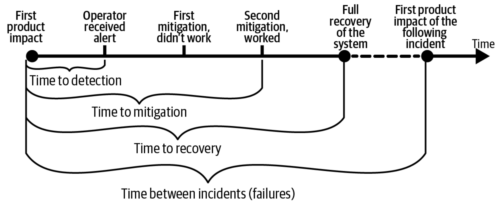

# План для DevOps переехал сюда: [`devops.md`](devops.md) 

  
Основные термины

| Термин | Значение |
|-|-|
|SLI | Текущий показатель обслуживания — 99.9% успешных запросов или 99.9% запросов обрабатываются менее чем за 1 секунду
|SLO | Цель уровня обслуживания — приложение отвечает быстрее 1 секунды в 99% случаев или сервис доступен 99,5% времени в году
|SLA | Документально утвержденная договоренность об уровне обслуживания с потребителями сервиса аналогична SLO, с возможными санкциями за нарушение или премиями за соблюдение
|Error Budget | Бюджет проблем - соотношение SLI к SLO которое помогает разработчикам планировать выполнение задач по улучшению показателей устойчивости и задач с добавлением или изменением функциональности в сервис. Если это соотношение меньше 100%, то в приоритете проблемы с доступностью или производительностью
|Инцидент | Ситуация при которой сервис выходит из нормального (стабильного) состояния, например диск базы данных заполняется с значительно большей скоростью чем раньше и на нем не останется места через 1 месяц, время ответа возросло с 1 сек до 2 сек, процент ошибок стал 0.4% вместо 0.06% 
|Postmortem | Проработка после инцидента — это анализ произошедшего и планирование мероприятий по предотвращению повторения подобного или уменьшению его последствий 
|MTTD | Время с начала инцидента до его обнаружения (командой мониторинга, сработавшее оповещение и т. д.)
|MTTR | Время с начала инцидента до полного устранения его влияния и восстановления нормальной работы сервиса
|MTTM | Время устранения влияния отличается от MTTR тем, что, возможно, есть поломка, но пользователи или партнеры не имеют проблем с нашим сервисом

  
1. Степень риска действий принимаемых по устранению инцидента не должна быть выше степени влияния инцидента

   1. Необходимо оценить текущую ситуацию. Чтобы было понимание, насколько все плохо, сколько пользователей и систем затронуто, ситуация стабильна или ухудшается.
      1. Для ответа на вопрос, насколько всё плохо, помогут золотые сигналы SRE
         1. Задержка — время ответа, проще замерять в перцентилях
         2. Ошибки нужно замерять относительно общего числа запросов и определять их в количественном соотношении. Также следует использовать инструменты вроде трейсинга или специализированные системы управления ошибками, например Sentry
         3. Частота запросов — измеряется в количестве запросов в секунду (желательно выводить, разделяя по кодам ответа или отдельно для ошибок и успешных запросов)
         4. Насыщенность — процент использования ресурсов: оперативной памяти или подключений к базе данных, троллинга ЦП, нагрузки на I/O, которые используются для прогнозов
      3. Требуется предоставить данные о количестве пользователей, у которых возникают ошибки, а также информацию о функциональности, работа которой нарушена. Необязательно сообщать о всех проблемах, главное – выявить критичные для бизнеса
      4. Ситуация считается стабильной, когда, например, частота ошибок остается постоянной на уровне 10% запросов или когда время отклика на уровне 99-го перцентиля превышает SLO, но остается стабильным на уровне 95-го перцентиля
   3. Чтобы предотвратить подобные инциденты, надо реализовать планы реагирования и восстановления, о которых будет рассказано ниже.
   4. Многие инженеры в состоянии стресса могут начать беспорядочно дергать за «рычаги», что может привести к еще более критическим последствиям. Например, когда ошибка была обнаружена во время запуска нового экземпляра приложения, инженер может принять решение перезапустить все экземпляры приложения, что приведет к каскадному сбою, поскольку ошибка была обнаружена в зависимой службе, которая требовалась только при запуске приложения (реплики, которые были созданы ранее, работали исправно). В такой ситуации может оказаться более полезным изучить сообщение об ошибке в журналах, а далее изучить проблему в другой службе, которую необходимо запустить, чтобы устранить проблему

  
2. Регулярно тестируйте планы по восстановлению и реагированию на инциденты

1. Уменьшите порог оповещения и следите за временем реагирования и действиями команд
2. Инструкции должны быть простыми и понятными, вплоть до фразы «нажми зеленую кнопку» (пункт 4 ниже)
3. Необходимо учесть временные показатели MTTD, MTTR и MTTM
4. После принятия мер по предотвращению или уменьшению влияния сымитируйте инцидент в тестовой среде, чтобы проверить, насколько они эффективны

  
3. Изменения, по возможности, должны применяться постепенно, используйте канареечные релизы

  1. Удобно реализовать canary в Kubernetes можно с помощью проекта Flagger. Но в нем есть нерешенные проблемы, которые способны привести к неполадкам.
  2. A/B-тестирование позволяет перенаправлять определенный трафик на новую версию приложения (на основе определенного заголовка или исходящего от пользователей Android)

  
4. Должна быть "большая красная кнопка" которая просто и быстро отменит изменения, которые привели к инциденту

   1. В шаге deploy есть кнопка отката helm-релиза или подготовленный запрос на слияние для восстановления предыдущего состояния
   2. Кнопка запуска пайплайна, который перенаправит трафик напрямую в кластер, если WAF будет недоступен
   3. В DRP рекомендуется использовать такие кнопки для автоматизации действий при инциденте

  
5. Проводить интеграционные тесты, наблюдая за тем, как наши изменения встариваются в общую архитектуру и взаимодействуют с другими компонентами

  
6. Необходимы резервные каналы связи в случае сбоя в основных каналах

  1. Канал в другом мессендежере при отказе основного, несколько каналов связи с сотрудником помимо мобильного номера
  2. Необходимо тестировать резервные каналы связи раз в квартал и иногда целенаправленно использовать один из них для экстренных оповещений

  
7. Предоставлять минимальную функциональность при ухудшении режима работы

  1. Сервис может предоставлять шаблонные ответы и частично искать данные из базы в ответах на запросы
  2. Например, режим авторизации позволяет авторизовать существующих пользователей без поддержки нескольких вариантов входа
  3. Выдача пользователям данным из резервной копии их списка избранных фильмов, но без возможности добавления новых
  4. Кешированный контент можно отдавать для части системы в случае проблем с backend-запросами, но только до восстановления его работоспособности

  
8. Хаос тестирование и тестирование катастрофоустойчивости

  
9. Автоматизация реагирования на сбои, которые мы можем предвидеть

  1. Этот пункт можно рассматривать как подпункт четвёртого из-за того, что «красная кнопка» автоматически сработает, когда известно, как решить проблему с симптомами А с помощью события B. Например, для менеджера пакетов Helm это предполагает автоматический откат выпуска при установке флага `--atomic`. В Kubernetes (k8s) автоматически завершение отправки запросов к pod с ReadinessProbe в статусе failed. SRE-инженеры, например, могут автоматизировать:
     1. Канареечные релизы с помощью сторонних утиилит (flagger от flux etc.) или вручную балансировать тафик, например на virtualService от istio выставляя "вес" для различных версий приложения
     2. В случае возникновения определенных симптомов (ошибки, долгое время ответа) сервис может быть переведен в режим ограниченной функциональности (например, он может предоставлять шаблонные ответы на определенные запросы и только частичный поиск данных из базы данных для других запросов)

  
10. По возможности чаще выпускать релизы что приведет к меньшему количеству инцидентов

  1. Установите бюджет ошибок, чтобы определить приоритеты задач. Если бюджет превышается, сосредоточьтесь на доработке и исправлении

  
11. Альтернативное решение для критически важных систем, которое их заменит в случае если в основной системе инцидент

  1. Нужно создавать несколько пулов node в Kubernetes. Таким образом, сбой в OS компонента узла/узлов приведет к частичной потере доступности.
  2. Делать резервные копии и репозиториев кода, и документации

Обновляемый перевод: https://sre.google/resources/practices-and-processes/twenty-years-of-sre-lessons-learned/
